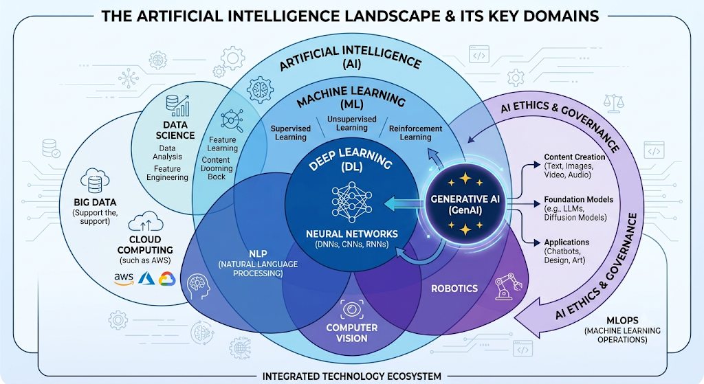

# Machine Learning: From Foundations to Production + Generative AI

**14-Week Course · 56 Hours · Python 3.11+**

A hands-on ML course covering supervised learning, deep learning, NLP, Generative AI (LLMs + RAG), and MLOps — built for learners going from Python basics to production-ready systems.

> This repo is also the companion codebase for the **YouTube series** — see [`youtube/episode_guide.md`](youtube/episode_guide.md) for the video-to-notebook mapping.

---

## What is Machine Learning?

Unlike traditional programming where you write rules for every scenario, ML algorithms **learn patterns from data** and handle new inputs automatically — making them ideal for tasks like spam detection, image classification, and data mining where writing explicit rules is impractical.



---

## Course Modules

| Week | Module | Topic |
|------|--------|-------|
| 1 | [Module 01](modules/01_python_for_ml/) | Python for ML — NumPy, Pandas, Matplotlib |
| 2 | [Module 02](modules/02_math_statistics/) | Math & Statistics — Linear Algebra, Calculus, Probability |
| 3 | [Module 03](modules/03_data_engineering_eda/) | Data Engineering & EDA |
| 4 | [Module 04](modules/04_regression/) | Regression — Linear, Ridge, Lasso, ElasticNet |
| 5 | [Module 05](modules/05_classification/) | Classification — Logistic, SVM, KNN, Naive Bayes |
| 6 | [Module 06](modules/06_ensemble_methods/) | Ensemble Methods — XGBoost, LightGBM, Optuna |
| 7 | [Module 07](modules/07_unsupervised_learning/) | Unsupervised Learning — K-Means, PCA, t-SNE ⭐ Mid-term |
| 8 | [Module 08](modules/08_deep_learning/) | Deep Learning — MLP, Backprop, TensorFlow, PyTorch |
| 9 | [Module 09](modules/09_computer_vision/) | Computer Vision — CNN, ResNet, YOLO, Transfer Learning |
| 10 | [Module 10](modules/10_nlp_generative_ai/) | NLP & Generative AI — BERT, Transformers, RAG, Agents |
| 11 | [Module 11](modules/11_time_series_recommenders/) | Time Series & Recommender Systems |
| 12 | [Module 12](modules/12_reinforcement_learning/) | Reinforcement Learning — Q-Learning, DQN |
| 13 | [Module 13](modules/13_mlops_deployment/) | MLOps & Deployment — MLflow, Docker, FastAPI, SageMaker |
| 14 | [Module 14](modules/14_capstone/) | Capstone Project — End-to-End Production System |

---

## Quick Start

### Option A — Conda (Recommended)
```bash
conda env create -f environment.yml
conda activate ml-course
jupyter lab
```

### Option B — pip + venv
```bash
python -m venv .venv
source .venv/bin/activate        # Windows: .venv\Scripts\activate
pip install -r requirements.txt
jupyter lab
```

### Download Datasets
```bash
python datasets/download_datasets.py
```

---

## Repository Structure

```
machine-learning-tutorial/
├── modules/                  # One folder per week
│   └── <module>/
│       ├── README.md         # Learning objectives + episode links
│       ├── notebooks/        # Lecture notebooks
│       ├── lab/              # Student starter files
│       └── solutions/        # Solutions (solutions branch only)
├── projects/
│   ├── midterm/              # Week 7 mid-term project
│   └── capstone/             # Week 14 final project
├── datasets/                 # Gitignored data; fetched by script
├── utils/                    # Shared plotting / preprocessing helpers
├── assets/img/               # Diagrams and visuals
└── youtube/                  # YouTube series planning
    ├── episode_guide.md      # Episode → notebook mapping
    └── descriptions/         # Video descriptions
```

---

## Projects

| Project | Week | Description |
|---------|------|-------------|
| [Mid-term](projects/midterm/) | 7 | End-to-end pipeline using Modules 1–6 |
| [Capstone](projects/capstone/) | 14 | Full production ML system with deployment |

---

## Prerequisites

- Python basics (functions, OOP, list comprehensions)
- Git fundamentals (clone, commit, push)
- Familiarity with statistics concepts

---

## Syllabus & Resources

- [Full Syllabus](ML_GenAI_Course_Syllabus.md)
- [AWS ML Certification Syllabus](ML_Course_Syllabus_MLA-C01.md)
- [YouTube Episode Guide](youtube/episode_guide.md)
- [Contributing Guide](CONTRIBUTING.md)
